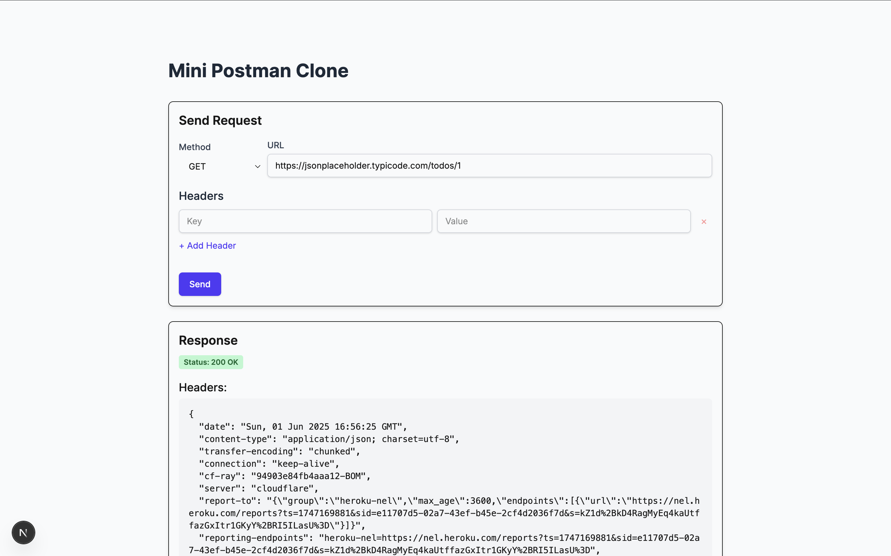
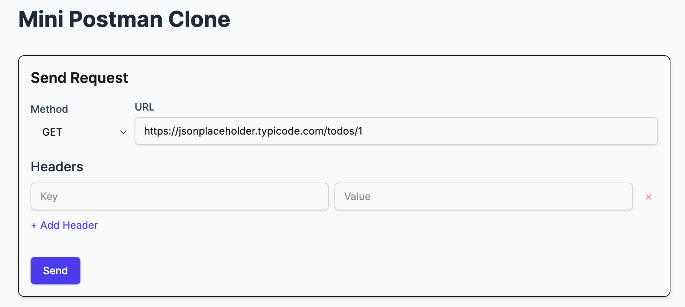
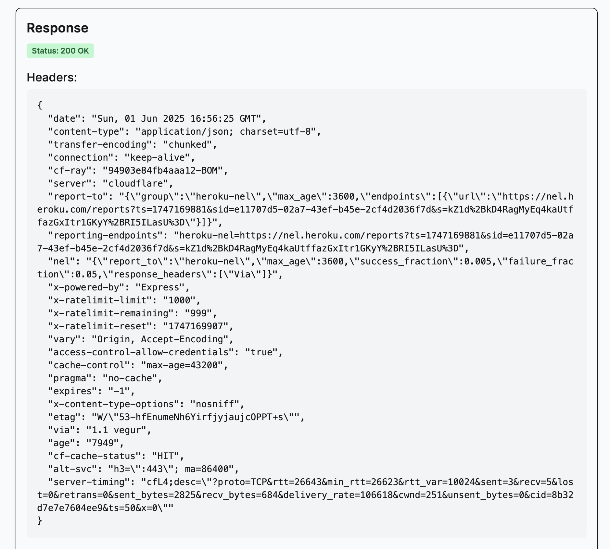
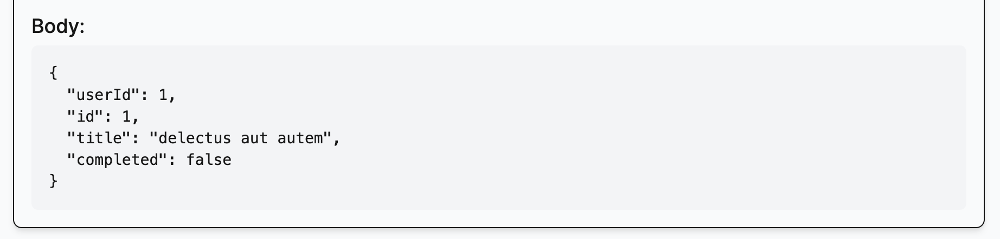
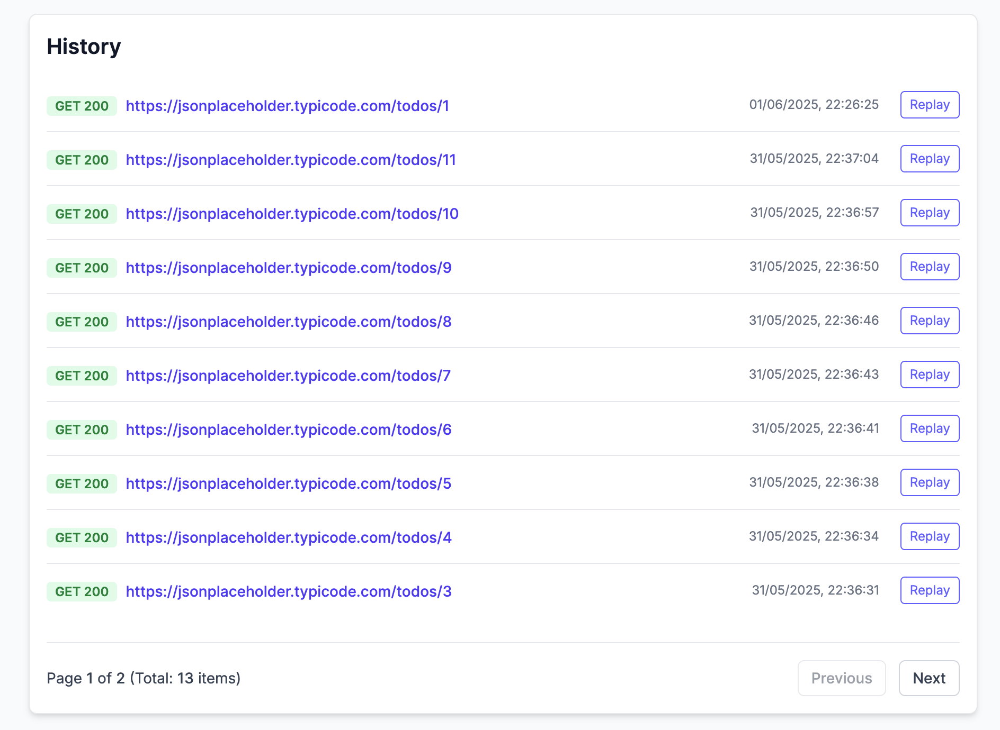

# QuickAPI - Your Lightweight API Client (REST Client)

A simplified web-based REST client application akin to Postman, built with Next.js, Node.js (via Next.js API Routes), and MikroORM. This project allows users to make HTTP requests (GET, POST, PUT, DELETE), view responses, and store/retrieve request history.

## Features

- **HTTP Request Execution:** Supports GET, POST, PUT, DELETE, PATCH, OPTIONS, and HEAD methods.
- **Customizable Requests:** Users can specify URL, method, request headers, and request body (for applicable methods).
- **Response Rendering:** Displays HTTP status, response headers, and response body. JSON responses are pretty-printed.
- **Request History:** All requests are automatically saved to a local SQLite database.
- **History Display & Pagination:** View past requests with pagination to efficiently handle a large number of entries.
- **Replay from History:** Easily populate the request form with data from a past request to re-run it.
- **Responsive UI:** Basic responsive design for usability on different screen sizes.
- **(Coming Soon/Partially Implemented):** Dark/Light theme support.

## Screenshots

**1. Main Interface (Request Form, Response, History):**



**2. Making a GET Request with Headers and Body:**



**3. Response and Body:**



**4. History View with Pagination:**



## Technology Stack

- **Frontend:**
  - Next.js (v13+ with App Router)
  - React
  - JavaScript (ES6+)
  - Tailwind CSS (for styling)
  - Axios (for client-side requests to own backend - though we primarily used `fetch`)
- **Backend (Next.js API Routes):**
  - Node.js
  - Axios (for making external HTTP requests)
- **Database:**
  - MikroORM (v6)
  - SQLite (for local development and history storage)
- **Development Tools:**
  - npm
  - ESLint
  - Git & GitHub

## Project Setup and Installation

1.  **Prerequisites:**

    - Node.js (v18.x or later recommended)
    - npm (usually comes with Node.js)
    - Git

2.  **Clone the Repository:**

    ```bash
    git clone https://github.com/beRajeevKumar/Mini_Postman
    cd QuickAPI
    ```

3.  **Install Dependencies:**

    ```bash
    npm install
    ```

4.  **Database Setup (MikroORM):**
    The application uses MikroORM with SQLite. The database schema will be created/updated automatically when the development server starts (due to `generator.updateSchema()` in `lib/db.js` for development convenience).

    Alternatively, you can manually ensure the schema is up-to-date:

    ```bash
    npm run mikro-orm schema:update --run -d
    ```

    A `rest_client_history.sqlite3` file will be created in the project root.

5.  **Environment Variables:**
    No specific environment variables (`.env.local`) are strictly required for the basic functionality with SQLite as configured. If you were to use a different database (e.g., PostgreSQL), connection details would go here.

6.  **Run the Development Server:**
    ```bash
    npm run dev
    ```
    The application will be available at `http://localhost:3000`.

## Build Process

To create a production build:

```bash
npm run build
```
